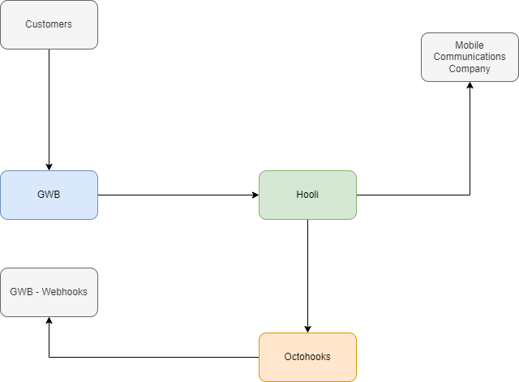

# The Hooli Case Study

Hooli is a leading financial technology (fintech) firm that specializes in airtime top-up solutions for businesses through API integration. In this case study, we will explore how Hooli helped Gringotts Wizarding Bank (GWB), a renowned bank in the wizarding world, to allow their customers to redeem their airtime top-up vouchers.

## Challenges

GWB faced challenges in enabling their customers to redeem airtime top-up vouchers. The existing process was time-consuming and inefficient, requiring customers to physically visit a vendor to redeem their vouchers. GWB needed a streamlined solution that would allow customers to redeem vouchers quickly and easily, while also ensuring timely notification of voucher redemption and expiry.

## Solution

To address GWB's challenges, they integrated with the Hooli's APIs to enable customers to redeem their vouchers seamlessly. Hooli also utilized Octohooks to give their platform webhook capabilities, allowing GWB to receive timely notifications when vouchers were redeemed or expired.

## Results

The integration of Hooli's airtime top-up solution with GWB resulted in a seamless and efficient process for customers to redeem their vouchers. The use of Octohooks enabled GWB to receive notifications in real-time, ensuring timely communication to customers. As a result, GWB was able to enhance its customer experience, increase customer satisfaction and retention, and streamline its operations.

## Conclusion

Hooli's airtime top-up solution through API integration and Octohooks provided GWB with a streamlined solution for their airtime voucher redemption process. The integration improved customer experience, increased customer satisfaction and retention, and enabled GWB to streamline its operations.

Here is the interface built by GWB, [https://demo.octohooks.com](https://demo.octohooks.com).

[https://webhook.site/#!/77b2ae27-f26c-43b2-852c-451f9a458653](https://webhook.site/#!/77b2ae27-f26c-43b2-852c-451f9a458653)

