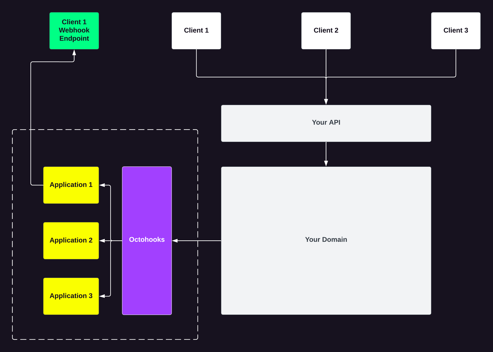

# Octohooks: The Scalable Webhook Provider Chosen by Hooli to Deliver Real-time Status Updates to API-Integration Partners

Hooli, a prominent SMS provider, allows its API integration partners to send SMS messages via its API. However, Hooli's partners required webhook functionality to receive real-time status updates. Since Hooli processes approximately 1.9 million SMS messages per day, it was essential to have a scalable webhook provider. After exploring several options, Hooli selected Octohooks to meet its requirements.

To fulfill the partners' requests, Hooli utilized Octohooks to create an application for each API-integration partner. These applications allowed the partners to add one or more endpoints to which real-time updates could be delivered. The endpoints could be configured to receive all or specific events, contain custom headers, and be rate-limited.

By using Octohooks, Hooli was able to promptly satisfy its partners' needs while maintaining low response times and high reliability, without expending any additional resources.

Here are the steps that Hooli followed to integrate with Octohooks:



## Install

Install the .NET Core library on your project or solution.

```bash
dotnet add package Octohooks.net
```

## Setup

Register the `OctohooksClient` with your dependency injection container.

```csharp
builder.Services
    .AddTransient((serviceProvider) => new OctohooksClient("AUTH_TOKEN"));
```

## Implement

* Ensure the required `using` statements are added to your file.
* Declare the `OctohooksClient` field in your controller `class`.
* Assign the `OctohooksClient` field in the constructor of your controller `class`.
* Use the `OctohooksClient` instance to make a request to [Octohooks](https://octohooks.com) in your controller method(s).

````csharp
// 1. Add the required using statements
using Octohooks.net;
using Octohooks.net.Requests;

[ApiController]
[Route("api/[controller]")]
public class MessagesController : ControllerBase
{
    private readonly MessageService _messageService;

    // 2. Declare the OctohooksClient field
    private readonly OctohooksClient _octohooksClient;

    public MessagesController(MessageService messageService, OctohooksClient octohooksClient)
    {
        _messageService = messageService ?? throw new ArgumentNullException(nameof(messageService));

        // 3. Assign the OctohooksClient field
        _octohooksClient = octohooksClient ?? throw new ArgumentNullException(nameof(octohooksClient));
    }

    [HttpPost]
    public async Task<IActionResult> Post(MessagesPostRequest request)
    {
        // 4. Use the JSON Web Token(JWT) to determine the applicationId associated to the client making the request
        var applicationId = GetApplicationIdFromToken();

        // Send the SMS via domain service
        var message = await _messageService.SendSms(request.MobileNumber, request.Body);

        // 5. Make a request to Octohooks
        await _octohooksClient.Message.Create(applicationId, new MessageRequest
        {
            Channels = new string[] { },
            EventType = "message.sent",
            Payload = message,
            Uid = message.Id.ToString(),
        });

        return Ok(message);
    }
}
```
