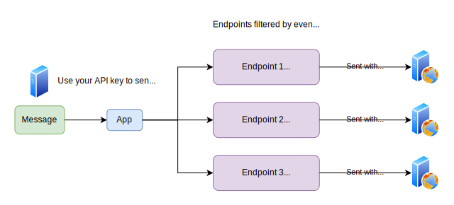
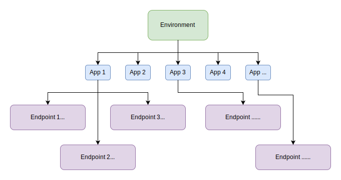

# Introduction

Octohooks makes sending webhooks easy and reliable by offering webhook sending as a service. With Octohooks you can start sending webhooks in minutes, while ensuring robust deliverability, and a great developer experience for your users.

## Webhooks are harder than they seem

Webhooks require a lot more engineering time, resources, and ongoing maintenance than you would first expect.

When building your own webhooks you have to deal with a lot of challenges, such as: unreliable user endpoints, which fail or hang more often than you think; monitoring and reliability of your webhook system; security implications which are unique to webhooks and much more.

This is where we come in. With Octohooks you can start sending webhooks in under five minutes, and we take care of all of the above and more.

# Quickstart

This page has everything you need to start sending webhooks with Octohooks.

## Main Concepts

In Octohooks you have three important entities you will be interacting with:

- `messages`: these are the webhooks being sent. They can have contents and a few other properties.
- `application`: this is where messages are sent to. Usually you want to create one application for each user on your platform.
- `endpoint`: endpoints are the URLs messages will be sent to. Each application can have multiple `endpoints` and each message sent to that application will be sent to all of them (unless they are not subscribed to the sent event type).

For more information, please refer to the [Overview section](OVERVIEW.md).

## Getting started

Get your authentication token (`AuthToken`) from the [Octohooks dashboard](https://example.com).

## Sending messages

### Creating a consumer application

Each of your users needs an associated consumer application. The easiest way is to create a new application whenever a user signs up. In this section we will use the create application API endpoint to create an application.

You would need the application's ID when sending messages. You can either save the `ID` returned when creating the application, or set your own unique id (e.g. your user's username or internal database ID) in the optional `UID` field and use that instead.

Code example:

```typescript
import { Octohooks } from "octohooks";

const octohooks = new Octohooks("AUTH_TOKEN");

const application = await octohooks.application.create({
  name: "Application name",
  uid: "application-name",
});
```

### Send a message

We will now send a new message using the [create message API endpoint](../API_DOCUMENTATION.md#create-message). It accepts an `APP ID`, which is the application's ID (or custom `UID`) from the previous section. In addition, it accepts the following fields (as part the json body):

- `eventType`: an identifier denoting the type of the event. E.g. invoice.paid.
- `uid`: an optional unique `ID` for the event. This is useful if you want to map each message to unique events on your system.
  `payload`: a JSON dictionary that can hold anything. Its content will be sent as the webhook content.

For example, the following code sends a webhook of type `eventType`, with the contents of `payload` as the body:

```typescript
import { Octohooks } from "octohooks";

const octohooks = new Octohooks("AUTH_TOKEN");

await octohooks.message.create("app_teexfqn3o09y1fnmm631r0fo8uq", {
  channels: [],
  eventType: "customer.created",
  uid: "774fa91a-510b-4a35-9799-6c233f6af790",
  payload: {
    email: "customer@email.com",
    integration: 100032,
    domain: "test",
    customer_code: "cus_xnxdt6s1zg1f4nx",
    id: 1173,
    identified: false,
    identifications: null,
    createdAt: "2016-03-29T20:03:09.584Z",
    updatedAt: "2016-03-29T20:03:09.584Z",
  },
});
```

#### Idempotency

Octohooks supports idempotency for safely retrying requests without accidentally performing the same operation twice. This is useful when an API call is disrupted in transit and you do not receive a response.

For more information, please refer to the [idempotency section](../advanced/IDEMPOTENCY.md) of the docs.

Note: while the `UID` can potentially be used to enforce short-term uniqueness (similar to idempotency), it's recommended to use the idempotency mechanism when needed rather than using on the `UID` checks.

### Add webhook endpoints

In the example above we showed how to send messages, though these messages were not sent to any specific URLs. In order for them to be sent, we need to add endpoints. This is what this section is about.

You can use our API to add endpoints to your applications.

For example:

```typescript
import { Octohooks } from "octohooks";

const octohooks = new Octohooks("AUTH_TOKEN");

await octohooks.endpoint.create("app_teexfqn3o09y1fnmm631r0fo8uq", {
  channels: [],
  enabled: true,
  eventTypes: ["customer.created"],
  headers: {},
  name: "My main endpoint",
  uid: 'my-main-endpoint',
  url: "https://api.example.com/octohooks-webhooks",
});
```

## Using Octohooks in a stateless manner

You can use Octohooks in a completely stateless manner, without having to store any Octohooks identifiers (or anything else) in your own database; you can do it by utilizing `UID`s. If you set a `UID` on an application, endpoint, or any other entity, you can use this `UID` interchangeably with its `ID` anywhere in the API.

For more information, please refer to the section about `UID`s in the overview.

# Overview

This section provides an overview of the main concepts of Octohooks and how to use them.

## Information flow

In Octohooks you can create multiple environments. Each environment is completely isolated from others. It has different data, different settings, and different API keys, among others.

Webhooks are called `messages`. You can use your API keys to send `messages` to `applications`. Each `application` can have multiple `endpoints`. A `message` sent to a specific application is sent to all of the relevant `endpoints` (filtered by `event type` and `channel`).



## IDs and UIDs

All Octohooks entities have `ID`s as their unique identifiers. Some entities, such as applications and endpoints, support an additional unique identifier called `UID`.

These `UID`s can be used interchangeably with `ID`s all throughout the API. So for example, you can send a message to a specific `ID`, or a specific `UID`, both will work.

This enables you to use Octohooks in a completely stateless manner, without having to store the Octohooks identifiers (or anything) in your own database.

## Entities

There are a variety of entities in Octohooks. The Octohooks entities are mostly hierarchical with the environment being the main isolation unit, below it there are applications which represent a target for messages, and even below there are endpoints which represent a destination to send webhooks to.



## Consumer Applications

When sending messages using the Octohooks API you will be sending them to a specific application (consumer), which will then distribute them to the associated endpoints. In most cases you would want to create one application for each of our customers, though in some cases you may want to create multiple applications per customer.

Each application lies within its own security context. Each application is completely isolated from another, but also there is no isolation within an application. This means that you should assume that every message sent to an application can be viewed by all of the endpoints subscribed to that application. What does this mean in practice? Create different applications for different security contexts.

You can define a `UID` for an application which can then be used interchangeably in the API with the application's `ID`. Most people set the `UID` to their own internal customer ID, so for example if they have a user called `some-user` they would set the `UID` to `some-user` and then use it with the Octohooks API as follows:

```typescript
import { Octohooks } from "octohooks";

const octohooks = new Octohooks("AUTH_TOKEN");

octohooks.application.update("some-user", {
  name: "Some User Application",
});
```

It's recommended to create an application (using the API) for each of their customers when they sign up to your service. You can however also create it "lazily", and only do it when they enable webhooks.

## Endpoints

Endpoints represent a target for messages sent to a specific application. You can have multiple endpoints per application, and every message sent to the application will be sent to all of them. Endpoints can have filters applied to them which will prevent them from receiving specific messages. The most common such filter is [event type](../basics/EVENT_TYPES.md), where an endpoint can choose to only subscribe to a limited set of events.

Endpoints can be created by you using [the create endpoint API](../API_DOCUMENTATION.md#create-endpoint).

Like with applications, you can define a `UID` for an endpoint which can then be used interchangeably in the API with the endpoint's `ID`.

## Messages

Messages are the webhooks being sent. They can have a content, event type, and a few other properties.

A message sent to an application will be sent to all of its endpoints (based on aforementioned filtering rules). When an application has no endpoints, or when no endpoints match a message, the sent message is just saved to the database but is not actually sent to a customer.

If a message delivery fails, it will be attempted multiple times until either it succeeds, or it attempts have been exhausted. Please refer to the [retry schedule](../advanced/RETRY_SCHEDULE.md) for more information.

Messages can have an associated `UID`. The `UID` is used to map a message from Octohooks to one in your system so you can easily map a message to the reason why you sent it.

## Attempts

Attempts represent an attempt that has been made to send a message to an endpoint. Attempts also record the response content of the attempt, the response HTTP status code, as well as other properties. Each attempt to send a message is recorded in an attempt entity which can then be queried (there can be multiple when there are failures).

## Event Types

Event types are identifiers on messages that describe the message being sent and implies its associated schema. Each message has exactly one event type, and endpoints can listen to all, or a subset of the created event types.

## Environments

Environments are completely isolated Octohooks environments that have their own API keys, data, and settings. You can think of Octohooks environments are completely separate accounts.

You can create as many environments as you want depending on your needs. Most people create one environment for `Production`, one for `Staging` and one for `Development`. Some people create multiple `Production` environments based on geographical regions e.g. `Production EU` and `Production US`.
